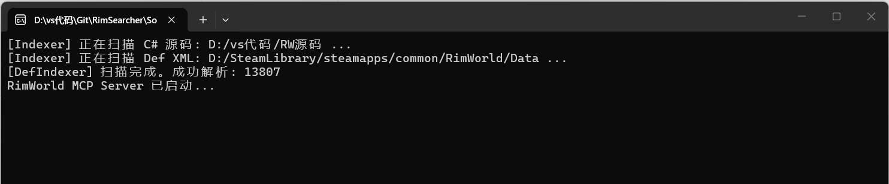

# RimSearcher: RimWorld 源码搜索 MCP 服务器

RimSearcher 是一个基于 Model Context Protocol (MCP) 实现的专用服务器，旨在为 AI 助手（如 Gemini, Claude 等）提供对 RimWorld
游戏源码（C#）和配置文件（XML）的高效检索与深度分析能力。

使用C# 14 和 .NET 10 开发，RimSearcher 利用 Roslyn 编译器平台实现了对 C# 代码的智能解析和方法体提取，同时支持 RimWorld 特有的 XML 定义解析逻辑。

本项目使用了Gemini辅助完成.

---

## 1. MCP 特点

* **高性能索引**：采用内存预扫描机制，支持对数万个 C# 文件和 XML Defs 的秒级检索。
* **低 Token 损耗**：
    * **精准定位**：直接返回方法体或特定的 XML 节点，避免传输冗余代码。
    * **分页机制**：源码读取支持行范围限制，防止上下文溢出。
* **智能 XML 解析**：支持 RimWorld 特有的 XML 继承逻辑（Abstract/ParentName），能够返回解析后的最终属性。
* **协议标准**：遵循 JSON-RPC 2.0 规范，通过标准输入输出（Stdio）与客户端通信，具有良好的兼容性。
* **项目已完整打包**：提供了编译好的单文件可执行程序，部署简单快捷。


---

## 2. 工具能力 (Tool Capabilities)

RimSearcher 暴露了以下 6 个强大的工具，所有工具均带有 `rimworld-searcher__` 前缀，并提供纯英文的元数据说明，以确保 AI（如 Gemini, Claude）能够精准理解并主动调用：

* **rimworld-searcher__locate**: **全域快速定位**。支持对 C# 类型、DefName、文件名进行模糊搜索。当 AI 知道名称但不知道文件位置时，这是首选的起点工具。
* **rimworld-searcher__inspect**: **深度资源解析**。核心功能：
    * **XML 继承解析**：自动处理 `ParentName` 模板合并，展示最终生效的数值。
    * **类关联提取**：自动识别 Def 关联的 `thingClass`, `workerClass` 等 C# 类并提供路径。
    * **类型结构展示**：为 C# 类型生成 Mermaid 继承图和类成员大纲。
* **rimworld-searcher__read_code**: **智能源码提取**。支持通过 `methodName` 直接提取完整方法实现，无需关心行号。若方法名不存在，会自动返回文件内的可用方法列表供 AI **自我修正**。
* **rimworld-searcher__search_regex**: **全域正则搜索**。在 C# 和 XML 全库范围内进行高级模式匹配，适合寻找特定字符串常量或复杂的代码模式。
* **rimworld-searcher__trace**: **引用与继承追踪**。支持寻找类的子类（下游继承）或在全库范围内查找特定符号的引用位置（上游调用）。
* **rimworld-searcher__list_directory**: **目录结构导航**。允许 AI 探索源码库的层级结构。

---

## 3. 技术栈

* **开发语言**: C# 14
* **运行时**: .NET 10.0
* **核心库**:
    * **Microsoft.CodeAnalysis.CSharp (Roslyn)**: 用于深度的 C# 语法树分析和方法体提取，能够像ide一样优雅得搜索相关引用和处理类的继承。
    * **System.Text.Json**: 高性能 JSON 序列化与协议解析。
    * **Microsoft.Extensions.Logging**: 标准化日志系统（日志输出至 stderr 以避免干扰协议流）。
* **项目架构**:
    * `RimSearcher.Core`: 包含索引引擎、Roslyn 辅助类及 XML 解析逻辑。
    * `RimSearcher.Server`: 负责 MCP 协议实现、工具注册及进程间通信。

---

## 4. 如何使用

* ### 前置要求
* 安装 .NET 10 SDK（这个可以在微软官网安装或者在你的ide里自动安装）

* ### 下载最新的.exe文件
* 访问 **[Releases](https://github.com/kearril/RimSearcher/releases)** 页面，下载最新版本的 RimSearcher.Server.exe 文件。

* ### 配置源码路径
* 新创建一个文件夹，将这个.exe文件放入其中，并在同一目录下创建一个名为 `config.json` 的文件，内容如下：

```json
{
  "CsharpSourcePaths": [
    "C:/Path/To/Your/RimWorld/Source"
  ],
  "XmlSourcePaths": [
    "C:/SteamLibrary/steamapps/common/RimWorld/Data"
  ]
}
```

**CsharpSourcePaths** 指向你反编译后的 RimWorld C# 源码目录，**XmlSourcePaths** 指向 RimWorld 的 Data 目录（包含所有 XML
定义文件）。
上面的源码里也包含了一个示例的 `config.json` 文件，你可以根据自己的环境修改路径。


> 到目前为止，你已经准备好了 MCP 服务器的可执行文件和配置文件，接下来就是将它集成到你的 AI 助手中，让它能够调用这些工具来分析
> RimWorld 的源码了。

### 验证服务器是否正常工作：
我们来到你放置这个.exe文件的目录，像这样


一定要确保config.json文件和.exe文件在同一目录下，以及你已经正确配置了路径。然后双击运行这个.exe文件，如果一切正常，你应该会看到类似下面的输出：

到现在，就大功告成了！你已经成功启动了 RimSearcher MCP 服务器，并且它已经准备好接受来自 AI 助手的请求了。

---

## 5. 安装至 AI 助手 (Installation)

在您的 AI 助手配置文件中（如 Claude Desktop 的 `mcpConfig.json` 或 Cursor 的 MCP 设置）添加以下配置：

```json
{
  "mcpServers": {
    "RimWorld-Expert-Analyzer": {
      "command": "D:/vs代码/Git/RimSearcher/Sources/Publish/RimSearcher.Server.exe",
      "args": [],
      "cwd": "D:/vs代码/Git/RimSearcher/Sources/Publish/"
    }
  }
}
```

> **注意**：`command` 请指向 `RimSearcher.Server.exe` 的**完整绝对路径**，`cwd` 则是该文件所在的**发布目录**。安装完成后，AI 助手会自动管理服务器进程的启动与关闭。

> 注意，`command` 需要指向你放置 RimSearcher.Server.exe 的完整路径，`cwd` 则是该可执行文件所在的目录。
> 确保路径正确无误，这样你的 AI 助手才能成功启动 MCP 服务器并与之通信。
> 还有，不用手动去运行这个.exe文件了，AI 助手会根据这个配置自动启动它。

---

#### 到目前为止，你已经成功安装了 RimSearcher MCP 服务器，并将其集成到了你的 AI 助手中。现在，你的助手应该能够通过 MCP 协议调用 RimSearcher 提供的工具来分析和查询 RimWorld 的源码了。

### 如果这个项目对你有帮助，欢迎在 GitHub 上给我点个 Star ⭐，这将是对我最大的支持！如果你有任何问题或者建议，也欢迎在 Issues 中提出，我会尽快回复。

*Powered by .NET 10 & Gemini Cli.*
