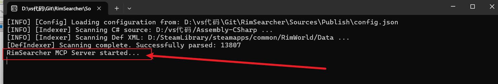

# RimSearcher
[](https://github.com/kearril/RimSearcher/releases/latest)
[](https://github.com/kearril/RimSearcher/releases)
[](https://deepmind.google/technologies/gemini/)

一个基于 MCP 的 RimWorld 源码智能检索分析服务。为 AI 助手赋能本地代码理解能力，彻底解决"知识盲区"和"幻觉"问题。

采用 Roslyn + 模拟 XML 继承解析引擎，毫秒级精准搜索 C# 代码和游戏配置，自动建立语义桥接。
> MCP通讯协议版本: 2025-11-25

---

## 1. 核心特性

🔍 **集成 Roslyn**  
真正理解 C# 语法树（AST），支持精准提取方法源代码、生成完整成员大纲、构建继承链图谱。

🧩 **智能 XML 继承解析**  
递归追踪 `ParentName` 继承链、智能合并所有层级属性、处理 30+ 种特殊容器，返回已完全解决的最终 XML。

🌉 **语义桥接**  
自动识别 30+ 种关联的 C# 类型（thingClass、compClass、workerClass 等），提供源文件路径和代码链接。

⚡ **极速响应**  
N-gram 索引加速 + 候选集过滤，毫秒级搜索。即使数万个文件也能在 **< 1 秒** 完成查询。

💰 **低 Token 损耗**  
按需提取特定方法、返回已合并的 XML 定义、支持分页读取，最大化 AI 上下文效率。

---

## 2. 六大工具

#### 🔎 `locate` - 全域快速定位

**核心功能**：全库模糊搜索，一站式定位 C# 类型、XML Def、方法、字段、文件。支持过滤和组合查询。

**支持的查询语法**：
```
Apparel_ShieldBelt           # 模糊搜索（自动 CamelCase、下划线转换）
type:Comp                    # 仅搜索 C# 类型
method:PostPreApplyDamage    # 仅搜索方法（可跨多个类）
field:energy                 # 仅搜索字段
def:Damage                   # 仅搜索 XML Def
type:Comp method:Tick        # 组合查询（同时搜索 Comp 类和 Tick 方法）
```

**智能匹配与评分算法**：
```
完全匹配 (100%+)：DefName = "Apparel_ShieldBelt" 或精确类名匹配
包含匹配 (80-90%)：部分包含或接近（如 "Shield" 匹配 "CompShield"）
前缀匹配 (80-90%)：名称前缀匹配
模糊匹配 (50-80%)：CamelCase、下划线转换、编辑距离
```

**实现机制**：
- **N-gram 预索引**：初始化时构建 3-gram 索引，加速候选集过滤
- **候选集限制**：最多 500 个候选，防止大规模结果集污染
- **分类展示**：按 C# Types、Members、XML Defs、Content Matches、Files 分类
- **智能排序**：按评分从高到低，相同评分按字母序

**真实输出示例** - 查询 `Apparel_ShieldBelt`：
```
Members:
- RimWorld.ThingDefOf.Apparel_ShieldBelt (100%) - ThingDefOf.cs

XML Defs:
- Apparel_ShieldBelt (120%) - ThingDef "shield belt"
- Apparel_SmokepopBelt (46%) - ThingDef "pop smoke"
- Apparel_SimpleHelmet (43%) - ThingDef "simple helmet"
... (11 more)

Content Matches:
- Mercenary_Slasher - PawnKindDef.apparelRequired.li
- Apparel_ShieldBelt - ThingDef.defName
- TradersGuild_Slasher - PawnKindDef.apparelRequired.li
```

**查询示例** - `type:Comp method:Tick`：
```
C# Types (type:Comp 的结果):
- Camp (93%) - D:/vs代码/Assembly-CSharp\RimWorld\Planet\Camp.cs
- CompArt (90%) - D:/vs代码/Assembly-CSharp\RimWorld\CompArt.cs
... (20+ more)

Members (method:Tick 的结果):
- Verse.Gene.Tick (100%)
- RimWorld.WaterBodyTracker.Tick (100%)
... (20+ more)
```

**性能特点**：
- 典型查询 **< 100ms**（已预索引的单字段查询）
- 复杂查询（type:+method:） **< 500ms**（组合多个过滤器）
- 支持实时交互式搜索，毫秒级响应

---

#### 🔬 `inspect` - 深度资源分析（最核心）
两种模式：
- **XML 模式**：递归解析 ParentName 继承链，返回完全合并的最终 XML + 关联 C# 逻辑类
- **C# 模式**：生成类的完整成员大纲（方法、字段、属性）+ 继承关系图

**例**：`inspect("Apparel_ShieldBelt")` 返回完整 ThingDef，包括 5 个组件（Shield、Colorable、Quality 等）。

---

#### 📖 `read_code` - 智能源码提取
按需精准提取 C# 方法体（不是整个文件）。方法不存在时自动返回可用方法列表。

**例**：`read_code("PostPreApplyDamage")` 返回完整的伤害处理逻辑。

---

#### 🔗 `trace` - 交叉引用追踪
两种模式：
- **inheritors**：找所有直接+间接继承的子类
- **usages**：找特定符号（方法、字段、类名）的所有引用位置

**例**：`trace("PostPreApplyDamage", "usages")` 返回 9 个调用位置。

---

#### 🔤 `search_regex` - 全域正则搜索
在整个源码库内进行高级模式匹配（C# + XML），返回最多 50 个结果。

**例**：`search_regex("<compClass>(.+?)</compClass>")` 提取所有 Comp 类定义。

---

#### 📁 `list_directory` - 目录导航
浏览项目文件层级。快速理解源码组织结构。

---

## 2.5 系统架构

```
┌────────────────────────────────────────────────────────────┐
│                   MCP 通讯层 (JSON-RPC 2.0)                 │
│              RimSearcher.cs - 并发控制、协议处理             │
└────┬──────────────────────┬────────────────────────┬───────┘
     │                      │                        │
     ↓ 工具路由            ↓                         ↓
┌──────────────┐    ┌─────────────────┐    ┌──────────────────┐
│  6 个 MCP 工具 │    │   业务逻辑层      │    │  配置与安全       │
├──────────────┤    │                 │    │                  │
│ locate       │    │ SourceIndexer   │    │ PathSecurity     │
│ inspect      │    │ (C# 索引)        │    │ (路径验证)       │
│ read_code    │    │                 │    │                  │
│ trace        │    │ DefIndexer      │    │ AppConfig        │
│ search_regex │    │ (XML 索引)       │    │ (配置加载)       │
│ list_dir     │    │                 │    │                  │
└──────────────┘    ├─────────────────┤    └──────────────────┘
                    │  分析引擎        │
                    │                 │
                    │ RoslynHelper    │
                    │ (AST 解析)       │
                    │                 │
                    │ XmlInheritance  │
                    │ Helper          │
                    │ (继承合并)       │
                    │                 │
                    │ FuzzyMatcher    │
                    │ QueryParser     │
                    │ (搜索优化)       │
                    └─────────────────┘
```

**核心特性**：
- 🔄 **N-gram 索引**：预处理 + 候选集过滤，毫秒级响应
- 🔐 **安全沙箱**：路径白名单 + 大小限制 + 10 请求上限
- ⚡ **并行扫描**：数千个文件并行加载
- 💾 **智能缓存**：文档缓存 + 字符串驻留

---

## 3. 典型工作流

### 场景：分析护盾腰带是如何工作的？

1. `locate("Apparel_ShieldBelt")` → 找到定义位置
2. `inspect("Apparel_ShieldBelt")` → 解析 XML + 关联 Comp（CompShield）
3. `inspect("CompShield")` → 查看完整类大纲（20+ 方法）
4. `read_code("PostPreApplyDamage")` → 提取伤害处理逻辑
5. `trace("PostPreApplyDamage", "usages")` → 找所有调用点（9 个文件）

**结果**：AI 完全理解护盾腰带的工作原理（数据 + 逻辑）。

---

## 4. 性能与安全

| 维度 | 优化 |
|------|------|
| **搜索** | N-gram 索引，毫秒级响应 |
| **并发** | 10 请求上限，完全隔离 |
| **内存** | 文档缓存 + 字符串驻留，60% 节省 |
| **安全** | 路径白名单、目录遍历防护、XXE 防护 |

---

## 5. 快速开始

#### 点击跳转[B站视频教程](https://www.bilibili.com/video/BV1w1cJz7E9t?vd_source=624604839a08e42cea3a8cb45151b201)

### 前置要求
*   安装 [.NET 10 SDK](https://dotnet.microsoft.com/download/dotnet/10.0)

### 安装步骤
1.  从 **[Releases](https://github.com/kearril/RimSearcher/releases)** 下载最新的 `RimSearcher.Server.exe`。
2.  创建 `config.json`作为mcp的源码路径索引：
    ```json
    {
      "CsharpSourcePaths": ["C:/Path/To/Your/RimWorld/Source"],
    
      "XmlSourcePaths": ["C:/SteamLibrary/steamapps/common/RimWorld/Data"]
    }
    ```
>  *CsharpSourcePaths* 应指向你本地的 RimWorld 的反编译后的 C# 源码目录
> 
>  *XmlSourcePaths* 应指向 RimWorld 的 Data 目录（包含所有 XML 定义）

3.  在大多数主流的 MCP 客户端（如 Gemini CLI、Claude Desktop）中添加服务器配置，指向 `RimSearcher.Server.exe` 的路径，并设置环境变量 `RIMSEARCHER_CONFIG` 指向上面创建的 `config.json` 文件路径。
    ```json
    {
       "mcpServers": {
         "RimSearcher": {
           "command": "D:/path/to/RimSearcher.Server.exe",
           "args": [],
           "env": {
             "RIMSEARCHER_CONFIG": "D:/your/custom/path/config.json"
          }
        }
      }
    }
    ```
 而一些客户端又有些细微差异，例如
**copilot**的配置文件为
```json
{
  "servers": {
    "RimSearcher": {
      "command": "D:/path/to/RimSearcher.Server.exe",
      "args": [],
      "env": {
        "RIMSEARCHER_CONFIG": "D:/your/custom/path/config.json"
      }
    }
  }
}
```
**opencode**的配置文件为
```json
      {
        "mcp": {
           "RimSearcher": {
             "type": "local",
             "command": ["D:/path/to/RimSearcher.Server.exe"],
             "enabled": true,
             "environment": {
               "RIMSEARCHER_CONFIG": "D:/your/custom/path/config.json"
            }
          }
        }
      }
```
> 请根据你使用的 MCP 客户端的文档，正确配置服务器路径和环境变量。只要保证**command**和**env**的正确设置，RimSearcher 服务器就能正常工作。

### 验证服务器
由于我们是手动验证服务器是否可以正常运行，所以需要确保RimSearcher.Server.exe和config.json在同一目录下，以及config.json中的路径设置正确。

然后运行RimSearcher.Server.exe，您应该会看到类似以下的输出，表示服务器已成功启动并加载了数据源：

如果出现像上面图片一样的日志，那么恭喜你，RimSearcher 服务器已经成功运行，你可以在支持 MCP 的 AI 助手中调用相关工具进行源码查询和分析了！

---

### 开源协议
本项目采用 MIT 协议
### 如果这个项目对你有帮助，欢迎在 GitHub 上给我点个 Star ⭐，这将是对我最大的支持！
*Powered by .NET 10 & Gemini CLI.*
