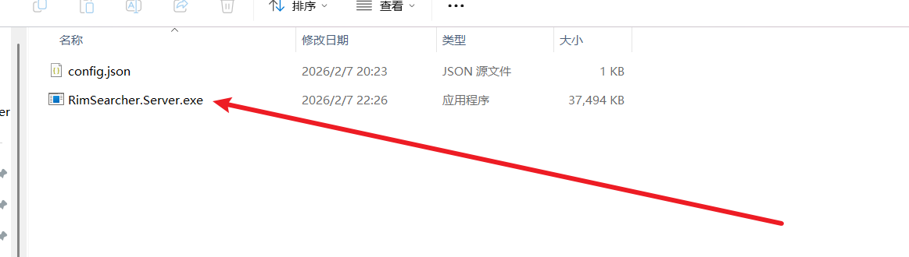
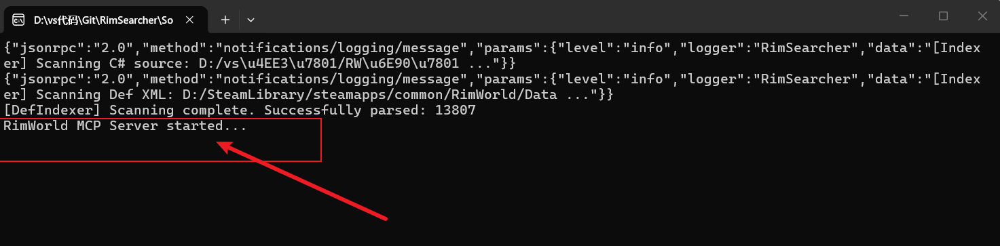

# RimSearcher: RimWorld 源码检索分析 MCP 服务器
[](https://github.com/kearril/RimSearcher/releases/latest)
[](https://github.com/kearril/RimSearcher/releases)
[](https://deepmind.google/technologies/gemini/)

RimSearcher 是 一个 基于 Model Context Protocol (MCP) 构建的高性能服务器，旨在为 AI 助手（如 Gemini, Claude 等）提供对 RimWorld 游戏源码（C#）和配置文件（XML）的高效检索与深度分析能力。

本项目专门针对 RimWorld 模组开发和源码研究而设计，利用 C# 14 和 .NET 10 的先进特性，结合 Roslyn 编译器平台，彻底解决了 AI 因无法直接访问本地源码而导致的“知识盲区”和“幻觉”问题。

---

## 1. 核心优势

*   **深度集成 Roslyn**：不同于普通的文本搜索，RimSearcher 能够理解 C# 语法树，支持**精准提取方法体**、生成**类成员大纲**以及构建**继承链图谱**。
*   **智能 XML 继承解析**：针对 RimWorld 复杂的 `ParentName` 继承系统，自动进行递归合并，返回 AI 能够直接理解的**最终生效 XML**。
*   **极速响应**：采用多线程内存预扫描机制，即使面对数万个文件的源码库，也能在毫秒级完成检索。
*   **低 Token 损耗**：
    *   **按需提取**：支持仅提取特定的 C# 方法或 XML 节点，避免将数千行的无关代码塞进 AI 的上下文。
    *   **智能分页**：对于超长文件，支持按行读取和分页查看，保护 AI 的上下文窗口。
*   **协议标准**：完全遵循 Anthropic 发布的 MCP 标准，无缝接入 Claude Desktop、Gemini CLI、Cursor 等支持 MCP 的 AI 工具。

---

## 2. 工具矩阵：强大的功能详解

RimSearcher 暴露了 6 个互补的工具，AI 会根据任务需求灵活调用：

### ️ `rimworld-searcher__locate` (全域快速定位)
*   **功能**：搜索入口。支持对 C# 类型名、XML DefName 或文件名进行模糊搜索。
*   **价值**：当 AI 知道一个术语（如 `Hediff_Injury`）但不知道它在哪个文件时，此工具能瞬间提供准确的物理路径，为后续分析打下基础。

###  `rimworld-searcher__inspect` (深度资源解析)
这是本项目最核心的工具，包含两种模式：
*   **XML 模式**：自动处理 `Abstract` 模板和 `ParentName` 继承，展示**解析后的最终 XML 属性**。同时自动识别关联的 `thingClass`、`workerClass` 等 C# 类，并提供其代码路径。
*   **C# 模式**：自动生成类的 **Mermaid 继承关系图** 和**成员大纲**（方法、字段、属性列表）。让 AI 瞬间掌握类的结构，无需通读几千行代码。

###  `rimworld-searcher__read_code` (智能源码提取)
*   **功能**：支持通过 `methodName` 直接提取特定的 C# 方法实现（利用 Roslyn 解析）。若方法名不存在，会自动返回可用方法列表供 AI **自我修正**。
*   **价值**：AI 往往只需要理解一个 `Tick()` 方法的逻辑。此工具直接返回该方法的闭合代码块，极大节省了 Token 并提高了逻辑理解的准确度。

###  `rimworld-searcher__trace` (引用与继承追踪)
*   **功能**：
    *   `inheritors` 模式：查找所有继承自该类的子类（例如：查找所有的 `HediffComp` 实现）。
    *   `usages` 模式：在全库范围内查找特定符号（变量名、方法名）的所有引用位置。
*   **价值**：用于分析代码的影响范围，寻找 Hook 点，或学习某种机制在游戏中的所有应用实例。

###  `rimworld-searcher__search_regex` (全域正则搜索)
*   **功能**：在全库范围内进行高级模式匹配。
*   **价值**：适合寻找特定的硬编码字符串、特定的 XML 标签值，或复杂的代码模式。

###  `rimworld-searcher__list_directory` (目录导航)
*   **功能**：浏览项目文件层级。
*   **价值**：帮助 AI 理解源码的组织结构或 Data 目录的分层。

---

## 3. AI 调用执行流程 (Execution Workflow)

为了让 AI 像人类专家一样思考，RimSearcher 设计了一套协同工作流。以下以 AI 分析 **“护盾腰带（Shield Belt）是如何工作的”** 为例：

1.  **第一步：全域定位 (Locate)**  
    AI 调用 `locate(query: "Apparel_ShieldBelt")`。  
    *结果：返回 `Defs/ThingDefs_Misc/Apparel_Belts.xml` 路径。*

2.  **第二步：数据解析 (Inspect XML)**  
    AI 调用 `inspect(name: "Apparel_ShieldBelt")`。  
    *结果：RimSearcher 解析继承关系，展示合并后的 XML。AI 在 `comps` 列表中发现了 `<li Class="CompProperties_Shield" />`。*

3.  **第三步：逻辑类锁定 (Inspect Comp)**  
    AI 调用 `inspect(name: "CompProperties_Shield")`。  
    *结果：AI 确认该属性类对应的逻辑实现类是 `RimWorld.CompShield`。*

4.  **第四步：结构分析 (Inspect Code)**  
    AI 调用 `inspect(name: "RimWorld.CompShield")`。  
    *结果：返回 `CompShield` 的继承图和成员大纲。AI 发现了 `CompTick`（能量回复）和 `PostPreApplyDamage`（伤害吸收）等核心方法。*

5.  **第五步：逻辑解析 (Read Code)**  
    AI 分别调用 `read_code(methodName: "PostPreApplyDamage")`。  
    *结果：AI 获取了护盾如何判断伤害来源、扣除能量、并在能量耗尽时触发 `Break()` 的具体 C# 实现。*

**最终产出**：AI 结合数据和逻辑，为您生成一份基于真实源码、逻辑严谨的技术报告，彻底告别“一本正经的胡说八道”。

---

## 4. 技术栈

*   **开发语言**: C# 14
*   **运行时**: .NET 10.0
*   **核心引擎**:
    *   **Roslyn (Microsoft.CodeAnalysis)**: 微软官方 C# 解析库，支持深度静态分析。
    *   **Custom XML Resolver**: 深度模拟 RimWorld 游戏引擎的 XML 加载与继承逻辑。

---

## 5. 快速开始

### 前置要求
*   安装 [.NET 10 SDK](https://dotnet.microsoft.com/download/dotnet/10.0)

### 安装步骤
1.  从 **[Releases](https://github.com/kearril/RimSearcher/releases)** 下载最新的 `RimSearcher.Server.exe`。
2.  在同目录下创建 `config.json`：
    ```json
    {
      "CsharpSourcePaths": ["C:/Path/To/Your/RimWorld/Source"],
    
      "XmlSourcePaths": ["C:/SteamLibrary/steamapps/common/RimWorld/Data"]
    }
    ```
>  *CsharpSourcePaths* 应指向你本地的 RimWorld 的 C# 源码目录
>  *XmlSourcePaths* 应指向 RimWorld 的 Data 目录（包含所有 XML 定义）

3.  在 AI 助手配置中添加：（可能需要创建mcp.json文件）（copilot的配置文件似乎需要把mcpServers改为servers）
    ```json
    {
         "mcpServers": {
          "RimSearcher": {
           "args": [],
           "command": "Folder path to RimSearcher.Server.exe",
           "cwd": "Folder path to RimSearcher"
         }
      }
    }
    ```
> *command*需要指向RimSearcher.Server.exe的完整路径，*cwd*需要指向RimSearcher所在的文件夹路径

### 验证服务器
首先我们必须确保RimSearcher.Server.exe和config.json在同一目录下，以及config.json中的路径设置正确。

然后运行RimSearcher.Server.exe，您应该会看到类似以下的输出，表示服务器已成功启动并加载了数据源：

到此，RimSearcher 服务器已经成功运行，您可以在支持 MCP 的 AI 助手中调用相关工具进行源码查询和分析了！

---

### 开源协议
本项目采用 MIT 协议
### 如果这个项目对你有帮助，欢迎在 GitHub 上给我点个 Star ⭐，这将是对我最大的支持！
*Powered by .NET 10 & Gemini CLI.*
